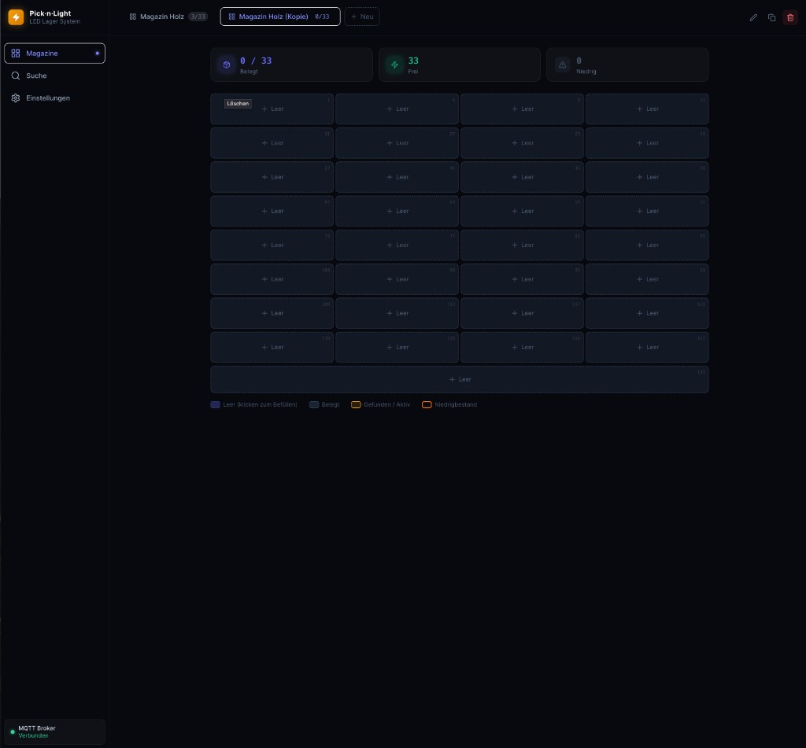

<p align="center">
  
</p>

<h1 align="center">Pick·n·Light</h1>

<p align="center">
  <em>LED-guided parts cabinet — find any part in seconds, not minutes.</em>
</p>

<p align="center">
  
  
  
  
  
</p>

---

<p align="center">
  <strong>Magazine Dashboard</strong><br>
  
</p>

---

### Table of Contents

- [What is Pick·n·Light?](#what-is-picknlight)
- [Features](#features)
- [Stack](#stack)
- [Quick Start](#quick-start)
- [Environment Variables](#environment-variables)
- [Traefik Setup](#traefik-setup)
- [WLED Integration](#wled-integration)
- [Voice Integration](#voice-integration)
- [API Reference](#api-reference)
- [Ports](#ports)
- [Project Structure](#project-structure)
- [Database Migrations](#database-migrations)

---

## What is Pick·n·Light?

Pick·n·Light is a self-hosted LED-guided parts management system for workshops, makerspaces, and electronics labs. You store screws, resistors, cables, or any small parts in numbered cabinet slots — and when you search for a part, the corresponding LED slot lights up instantly so you don't have to read every label.

It uses [WLED](https://kno.wled.ge/)-powered LED strips (one per cabinet) controlled over MQTT. The web UI lets you manage multiple cabinets ("Magazine"), assign parts to slots, set minimum stock levels, and search by name, description, or tag.

> **📝 Note:** Built with AI assistance (Cursor AI). Tested on real hardware with WS2812B LED strips.

---

## Features

- **💡 LED-guided Search**  
  Type a search term — the matching cabinet slot lights up in amber within milliseconds. All other LEDs turn off automatically after a configurable timeout.

- **📦 Multi-Cabinet Support**  
  Manage any number of physical cabinets. Each has its own LED strip, row/column layout, and WLED device.

- **🧱 Wall View**  
  View 2, 4, or more cabinets side by side in a configurable grid — perfect for a wall-mounted tablet showing your entire storage wall at once.

- **🏷️ Global Tags with Autocomplete**  
  Tags are shared across all parts. When typing a tag, existing tags from your entire inventory are suggested — so you can group all screws, all capacitors, or all M4 hardware regardless of which cabinet they're in.

- **📉 Low-Stock Warnings**  
  Set a minimum quantity per part. Slots below the threshold are highlighted in orange and counted in the stats bar.

- **🧩 Flexible LED Mapping**  
  Configure LEDs per slot, gap LEDs between slots, row padding, a global strip offset, serpentine layout, strip origin corner, and a special large bottom slot — all without touching code.

- **🎙️ Voice Search (Alexa / Home Assistant)**  
  A webhook endpoint accepts voice queries from Alexa Skills, Home Assistant automations, or IFTTT — the LED lights up hands-free.

- **📱 Fully Responsive**  
  Optimized for both desktop and mobile (iPhone 15 / Android). Bottom navigation bar on small screens, bottom-sheet modals, safe-area support.

- **🔁 Cabinet Duplication**  
  Duplicate any cabinet configuration (without its parts) to quickly set up an identical second cabinet.

- **🌐 MQTT-native**  
  Includes a bundled Eclipse Mosquitto 2 broker. WLED devices subscribe natively — no custom firmware needed.

---

## Stack

| Layer | Technology |
|---|---|
| Frontend | React 18, Vite, TypeScript, Tailwind CSS, Framer Motion |
| Backend | Node.js 20, Express, TypeScript, Prisma ORM |
| Database | PostgreSQL 16 |
| LED Control | WLED (MQTT JSON API) |
| MQTT Broker | Eclipse Mosquitto 2 (bundled) |
| Serving | Nginx (SPA + API reverse proxy) |
| Containerisation | Docker + Docker Compose |

---

## Quick Start

### Prerequisites

- Docker + Docker Compose
- One or more WLED devices on your local network (WS2812B / SK6812 LED strip)
- (Optional) Traefik reverse proxy for SSL

### Install

```bash
git clone https://github.com/youruser/picknlight.git
cd picknlight

cp .env.example .env
# Edit .env — set at minimum POSTGRES_PASSWORD
nano .env

docker compose up -d
```

Docker Compose builds both images on first run, applies all database migrations automatically, and starts all services. Open **http://localhost:7050** — the setup wizard guides you through creating your first cabinet.

**Rebuild after a code change:**

```bash
docker compose up -d --build
```

---

## Environment Variables

Create `.env` from the example file and adjust these values:

```env
# Required
POSTGRES_PASSWORD=your_secure_password

# Optional — defaults shown
POSTGRES_USER=picknlight
POSTGRES_DB=picknlight
JWT_SECRET=changeme
LED_AUTO_OFF_SECONDS=30
```

| Variable | Default | Description |
|---|---|---|
| `POSTGRES_PASSWORD` | — | PostgreSQL password **(required)** |
| `POSTGRES_DB` | `picknlight` | Database name |
| `POSTGRES_USER` | `picknlight` | Database user |
| `JWT_SECRET` | — | Secret for future auth (optional) |
| `LED_AUTO_OFF_SECONDS` | `30` | Seconds until LEDs auto-off after search |

---

## Traefik Setup

The `docker-compose.yml` already includes Traefik labels on the Nginx service. Adjust the domain:

```yaml
labels:
  - traefik.enable=true
  - traefik.http.routers.picknlight.rule=Host(`picknlight.yourdomain.com`)
  - traefik.http.routers.picknlight.tls=true
  - traefik.http.routers.picknlight.tls.certresolver=cloudflare
  - traefik.http.services.picknlight.loadbalancer.server.port=7050
```

If Traefik runs on a different host (e.g. via [traefik-kop](https://github.com/jittering/traefik-kop)), create the external proxy network first:

```bash
docker network create proxy
docker compose up -d
```

---

## WLED Integration

Pick·n·Light controls LED strips via WLED's native MQTT JSON API — no custom firmware needed.

### Setup

1. Flash [WLED](https://kno.wled.ge/) to an ESP8266/ESP32 connected to your LED strip
2. In WLED settings → **Sync** → enable **MQTT**, set broker IP to your server, and set a topic (e.g. `wled/magazin1`)
3. In Pick·n·Light → **Settings** → add a WLED device with the same IP and MQTT topic

### How it works

When a search matches a slot, Pick·n·Light publishes a two-segment WLED JSON state:

```json
{
  "on": true, "bri": 255,
  "seg": [
    {"id": 0, "start": 0, "stop": 9999, "col": [[0,0,0]], "fx": 0, "on": true},
    {"id": 1, "start": 5, "stop": 9,   "col": [[255,165,0]], "fx": 0, "on": true}
  ]
}
```

Segment 0 blacks out the entire strip. Segment 1 lights only the matching slot.  
`stop: 9999` is a sentinel — WLED clips it to its actual strip length automatically.

### LED Layout Configuration

Each cabinet stores a complete LED mapping:

| Parameter | Description |
|---|---|
| `ledsPerSlot` | LEDs illuminated per slot |
| `ledGap` | Inactive LEDs between slots on the same row |
| `rowPadding` | Skip LEDs at both ends of each row |
| `ledSkipFirst` | Global offset (dead LEDs at strip start) |
| `serpentine` | Zigzag: even rows →, odd rows ← |
| `stripOrigin` | Corner where LED 0 is: `top-left / top-right / bottom-left / bottom-right` |
| `bottomRowLarge` | Last row is one wide slot (e.g. for a drawer) |
| `largeRowLeds` | Override LED count for the large bottom slot |

---

## Voice Integration

### Home Assistant

```yaml
rest_command:
  picknlight_search:
    url: "http://picknlight:7050/api/voice/search"
    method: POST
    content_type: "application/json"
    payload: '{"query": "{{ query }}"}'
```

Then call it from any automation, script, or voice assistant integration:

```yaml
service: rest_command.picknlight_search
data:
  query: "M4 Senkkopfschraube"
```

### Alexa Custom Skill

Create a Custom Skill with a `SearchIntent` and a `{query}` slot variable.  
Point the endpoint at: `POST https://your-domain.com/api/voice/search`

### IFTTT / Generic Webhook

```bash
curl -X POST https://your-domain.com/api/voice/search \
  -H "Content-Type: application/json" \
  -d '{"query": "10k Widerstand"}'
```

The matching LED slot lights up immediately. If nothing is found, all LEDs flash red.

---

## API Reference

### Magazines
```
GET    /api/magazines                   List all cabinets
POST   /api/magazines                   Create cabinet (slots auto-calculated)
GET    /api/magazines/:id               Cabinet with all slots + parts
PUT    /api/magazines/:id               Update cabinet (LED params recalculate slots)
DELETE /api/magazines/:id               Delete cabinet
POST   /api/magazines/:id/duplicate     Duplicate cabinet (without parts)
```

### Parts
```
POST   /api/parts                       Create part in slot
GET    /api/parts/:id                   Get part
PUT    /api/parts/:id                   Update part
DELETE /api/parts/:id                   Delete part
```

### Search
```
GET    /api/search?q=query              Search + trigger WLED LED
POST   /api/search/highlight/:slotId    Manually light a slot
DELETE /api/search/highlight            Turn off all LEDs
```

### Tags
```
GET    /api/tags                        All unique tags across all parts (global)
```

### WLED Devices
```
GET    /api/wled/devices                List devices
POST   /api/wled/devices                Add device
PUT    /api/wled/devices/:id            Edit device
DELETE /api/wled/devices/:id            Remove device
POST   /api/wled/devices/:id/test       LED test (flash / sequence)
POST   /api/wled/devices/:id/all-off    Turn off all LEDs
```

### Voice Webhook
```
POST   /api/voice/search                { "query": "M4 Schraube" }
```

### Settings
```
GET    /api/settings                    Get all settings
PUT    /api/settings                    Update settings
```

---

## Ports

| Service | Internal | Host |
|---|---|---|
| Nginx (app) | 80 | **7050** |
| MQTT (TCP) | 1883 | 1883 |
| MQTT (WebSocket) | 9001 | 9001 |
| Backend API | 3000 | internal only |
| PostgreSQL | 5432 | internal only |

---

## Project Structure

```
picknlight/
├── frontend/                   # React + Vite SPA
│   └── src/
│       ├── components/         # MagazineGrid, SlotModal, Sidebar, WallMagazineCard, …
│       ├── pages/              # Dashboard, Search, Settings, Onboarding
│       ├── lib/                # API client, TypeScript types, utilities
│       └── store/              # Zustand global state (persisted)
├── backend/                    # Node.js + Express API
│   └── src/
│       ├── routes/             # magazines, parts, search, wled, voice, settings, tags
│       ├── services/           # WLED MQTT service, LED calculator
│       └── prisma/             # Schema + migrations
├── mosquitto/                  # Mosquitto config
├── nginx/                      # Nginx reverse proxy config
├── docs/                       # Screenshots
├── docker-compose.yml
├── .env.example
└── picknlight.md               # Full developer reference (schema, API, LED math)
```

---

## Database Migrations

All migrations run automatically on container startup via `prisma migrate deploy`.

To run manually inside the container:

```bash
docker compose exec backend npx prisma migrate deploy
```

| Migration | Changes |
|---|---|
| `001_initial` | magazines, slots, parts, wled_devices, settings |
| `002_add_led_gap` | `led_gap` column |
| `003_add_serpentine` | `serpentine` column |
| `004_add_strip_origin` | `strip_origin` column |
| `005_skip_first_and_large_row` | `led_skip_first`, `large_row_leds` columns |
| `006_add_row_padding` | `row_padding` column |

For the full schema documentation see [`picknlight.md`](picknlight.md).
